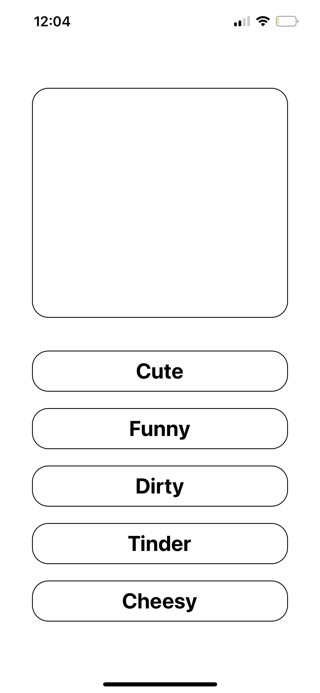
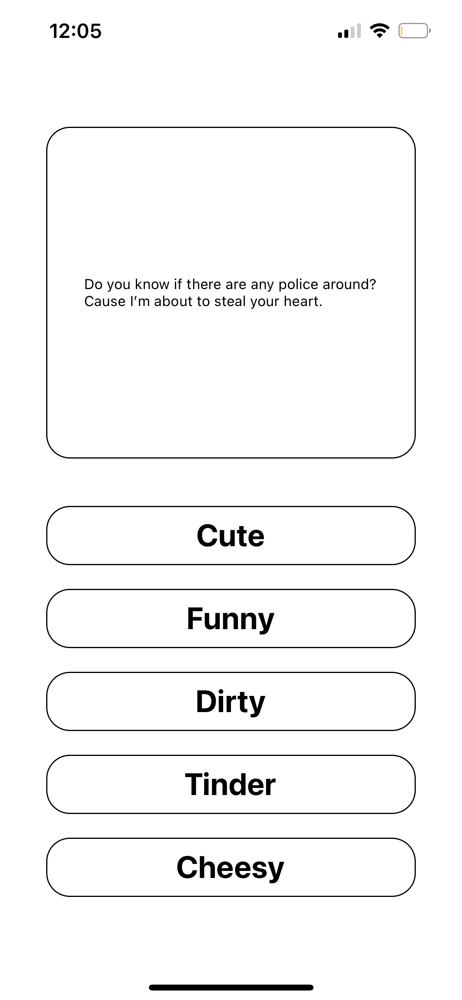

# Pick-Up-App

A React Native app to help with pick up lines.

---

## Technologies

* [React](https://reactjs.org/)
* [React-Native](https://reactnative.dev/)
* [Expo](https://expo.dev/)
* [Axios](https://axios-http.com/docs/intro)
* [API](https://rapidapi.com/markovic-m/api/pick-me-up)

---

## Installation and Start Guide

```
npm i -g expo-cli
npm install axios
```

Once you project is set up start the npx app.

```
npm start
```

---

## Demo

Before pressing one of the options you should see a blank screen.


After pressing a message with the desired pick up line will pop up for use.


---

## Contributors

Main contributer **Santiago Hernandez**
- [dsmannight@gmail.com](dsmannight@gmail.com)

---

## License

This application is free for non-profit use.
